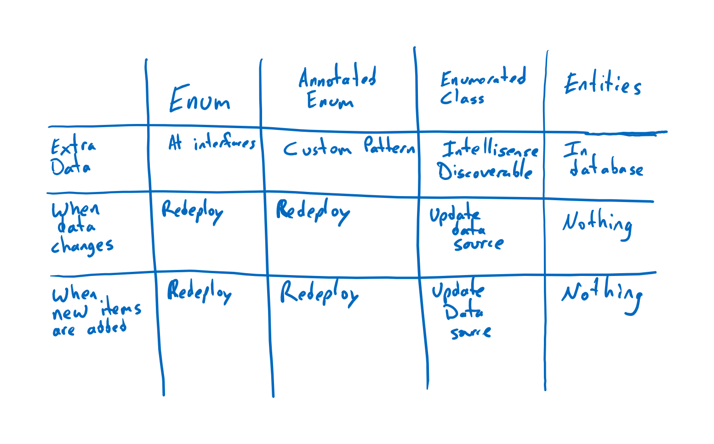

# Enumerated classes
Populating drop-down lists and multi-select lists has always been a challenge in interactive software. Some lists can be hard-code because they do not change (male/female, yes/no, day/night). Other lists have to be more dynamic, such as States the company services. Further, some known options in lists are required for business logic while others can be loaded from a database.  Here are the general options you have to choose from the characteristics of them.

# Design options
Java enums are very different from C# enums. In some way, Java has more built-in support in the language for richer enums, whereas C# leaves more up to the programmer. Regardless, any need can be satisfied with the right design pattern. The programmer must understand the tensions of the software in order to know the appropriate architectural element to introduce.

## Option 1: C# enumerations
C# enums (enumerations) are compiled in code and have a value of an Int32 but can be made smaller by using the smaller integer types (short, etc). They have the name available as well as the integer value. Any change requires the software to be redeployed.

## Option 2: Enumerations with attributes
With some custom reflection, one can add any number of attributes onto a enum value. This can allow any number of additional pieces of information to be attached.  But new values cannot be dynamically loaded from a database or changes without redeploying the software.

## Option 3: Enumerating C# classes
Enumerated classes is a design pattern that uses regular C# classes while making the usage syntax appear like a C# enum. No enum is actually used, but the intellisense experience and the syntax is nearly identical. This approach allows for an arbitrary number of additional properties on an enumerated value while also allowing properties to be updated at runtime as well as additional values in the enumerated listing to be added from any type of database.

# Summary
Several very feasible options exists for managing drop-down lists and multi-select lists in applications. Each option comes with different capabilities and limitations before a change would require a redeployment of the software.

